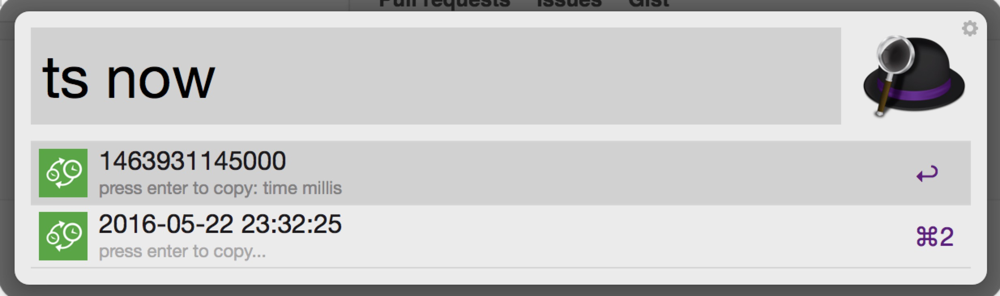
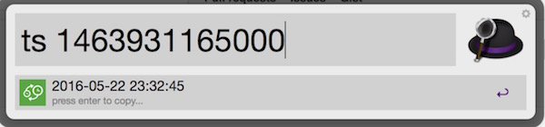
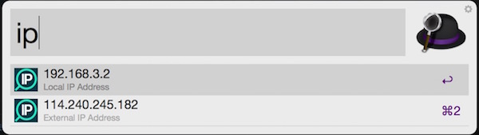

# workflow
Alfred workflows, including:
1. timestamp convertor, convert millis to time string. Written in shell!
2. get your ip address.

[Download](https://raw.github.com/ishare/workflow/master/TimestampConvertor.alfredworkflow)

## Usage:
ts [now or timeInMillis or timeInSeconds]

type `ip` to get your ip:

