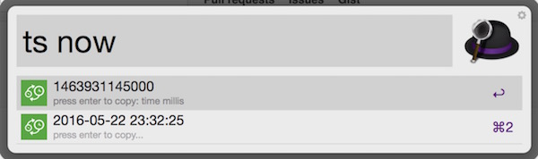
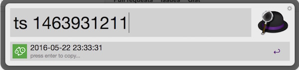

# workflow
Alfred workflows, including:

1. timestamp convertor, convert millis to time string. 
[[Download](https://raw.github.com/ishare/workflow/master/TimestampConvertor.alfredworkflow)]

2. get your ip address.
[[Download](https://raw.github.com/ishare/workflow/master/IP.alfredworkflow)]

## Usage:
ts [now or timeInMillis or timeInSeconds]

type `ip` to get your ip:

